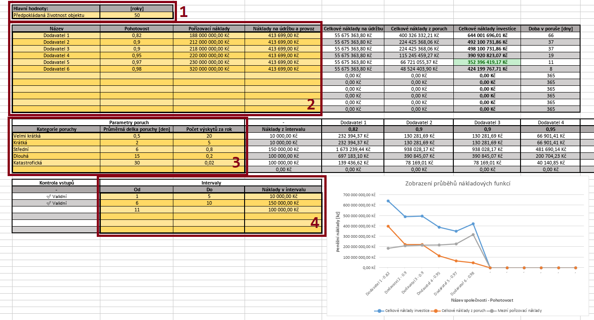

## Ovládání nástroje

Nástroj se ovládá konfigurací **vstupních hodnot** podle aktuálního projektu.

### Rozlišení buněk
- 🟨 **Vstupní pole** (podbarvena žlutou) - určena pro uživatelský vstup
- ⬜ Ostatní buňky - výstupní nebo pro mezivýpočty (uživatel by do nich neměl zasahovat)

---

## Části vstupních polí

### 1. Hlavní hodnoty
- **Předpokládaná životnost objektu** [roky]  
  *(stejná hodnota pro všechny scénáře)*

### 2. Hodnoty scénářů (max. 12 scénářů)
| Pole | Popis | Formát |
|------|-------|--------|
| **Název** | Libovolný komentář | Text |
| **Pohotovost** | Úroveň pohotovosti | Číslo 0-1 |
| **Pořizovací náklady** | Prvotní investice | Částka |
| **Náklady na údržbu a provoz** | Roční suma | Částka |

### 3. Parametry poruch (max. 6 kategorií)
| Pole | Popis | Jednotky |
|------|-------|----------|
| **Kategorie poruchy** | Název (např. z matice rizik) | Text |
| **Průměrná délka poruchy** | Doba trvání poruchového stavu | Dny |
| **Počet výskytů za rok** | Frekvence poruch | Počet/rok |

### 4. Intervaly nákladů (max. 6 intervalů)
- **Struktura každého intervalu**:
  - Počátek intervalu (OD)
  - Konec intervalu (DO)
  - Náklady na den

#### Pravidla pro intervaly:
1. První interval musí začínat hodnotou `1`
2. Intervaly musí navazovat (např. 5→6)
3. Žádné záporné hodnoty

#### Kontrola validity:
| Stav | Hláška | Význam |
|------|--------|--------|
| ✅ | `✔ Validní` | Správný formát |
| ❌ | `⛔ OD musí být 1` | Chyba v prvním intervalu |
| ❌ | `⛔ DO ≤ OD` | Neplatný rozsah |
| ❌ | `⛔ Intervaly nenavazují` | Chybějící návaznost |
| ❌ | `⛔ Záporné číslo` | Neplatná hodnota |

