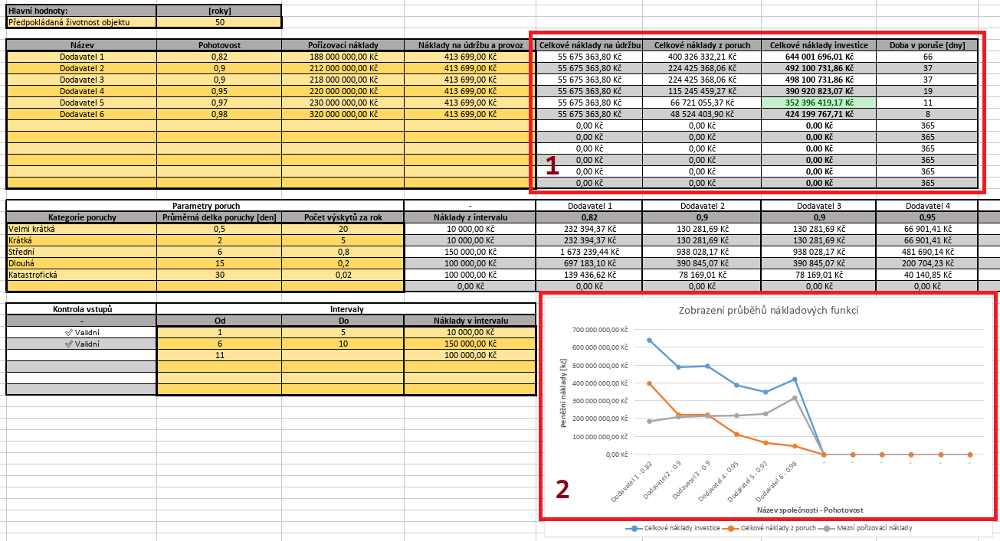

## Přehled výsledků

Nástroj generuje dva hlavní typy výstupů:

### 1. Souhrnná tabulka nákladů
Zobrazuje klíčové finanční ukazatele pro celou životnost objektu:

- **Celkové náklady na údržbu**  
  *Včetně roční 2% inflace*
- **Náklady způsobené poruchami**  
  *Kumulovaná částka za všechny poruchové stavy*
- **Celková investice**  
  *Součet všech nákladových položek*
- **Celková doba výpadků**  
  *Vyjádřeno ve dnech na základě zadané pohotovosti*

### 2. Srovnávací graf scénářů

**Osy grafu:**
- **Vodorovná**: Kombinace názvu scénáře a hodnoty pohotovosti
- **Svislá**: Finanční náklady v korunách

**Zobrazené křivky:**
1. **Modrá** - Celkové investiční náklady
2. **Šedá** - Čisté pořizovací náklady
3. **Oranžová** - Náklady plynoucí z poruch

### Doplňkové výstupy
Nástroj navíc poskytuje:
- Detailní roční projekce
- Rozpis inflačních vlivů
- Analýzu citlivosti na klíčové parametry

